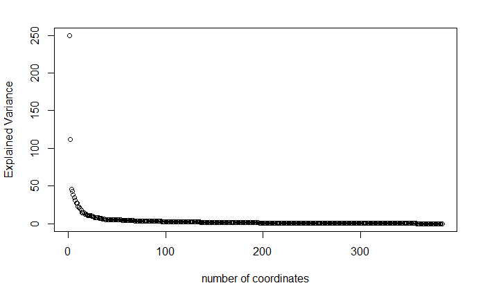
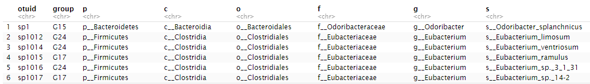
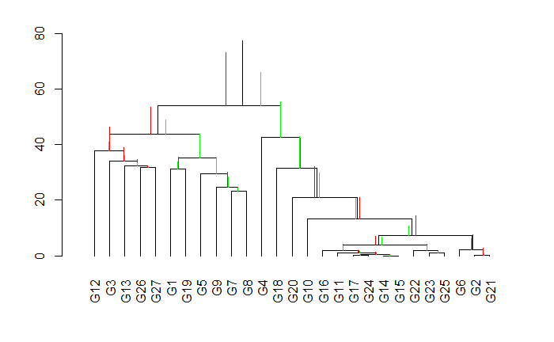

# PMGs

*Principal Microbial Groups : a new way to explore microbiome data*

***
PMG = Principal Microbial Groups.
This R package provides functions for the analysis of compositional data (e.g., data representing proportions of different variables/parts). Specifically, this package allows analysis of microbiome data where the OTUs can be grouped through a SBP (sequential binary partitioning) and provides a balance of OTU groups to be utilized for for the search of biomarkers in human microbiota. 

## Quick Start ##

`PMGs` procedure is illustrated on a cirrhosis study data. Data is obtained from the https://github.com/knights-lab/MLRepo.

Load Cirrhosis Data
``` r
library(readr)
tax_otu <- read.table('data/processed_taxatable.txt', sep="\t",header = TRUE) 
tax<-tax_otu[,1:7]
otu<-tax_otu[,-(1:7)]
labels <- read.table('data/task-healthy-cirrhosis.txt', sep="\t",header = FALSE) 
```

Create a Phyloseq object. Data is filtered and 0's are replaced. TAX table and Sampledata are organized.

```{r}
library(phyloseq)
OTU<-otu_table(otu, taxa_are_rows=TRUE) # taxas x samples
TAX<-tax_table(as.matrix(tax))
SAMPLEDATA<-sample_data(as.data.frame(labels))
taxa_names(OTU)<-taxa_names(TAX)
sample_names(OTU)<-sample_names(SAMPLEDATA)
cir<- phyloseq(OTU,TAX,SAMPLEDATA)
#Taxa that were not seen with more than 20 counts in at least 30% of samples are filtered.
cir2 <-  filter_taxa(cir, function(x) sum(x > 20) > (0.3*length(x)), TRUE)
OTU<-t(as.data.frame(otu_table(cir2)))
library(zCompositions)
otu.no0<-cmultRepl(OTU)
TAX<-as.data.frame(tax_table(cir))
TAX$otuid<-rownames(TAX)
SAMPLEDATA$Label<-ifelse(grepl("Cirrhosis", SAMPLEDATA$V2), 1, 0)
names(SAMPLEDATA)<-c("sampleID","Status","Label")
```

Before `PMGs` construction, the analyst should decide the minimum number of groups to construct. 
We chose 25 as minimum number for the demo dataset. It means that minimum 24 principal balances will be used for PMG construction. 
```{r}
V<- mPBclustvar(X) #
coord<-milr(X,V)
plot(diag(var(coord)),xlab="number of coordinates",ylab="Explained Variance")
```


Optimal number of groups is calculated by the method findOptimalNumOfGroups(otu,min). This method uses logistic regression for each number of `PMGs` and determines the best number of `PMG` choosing the best accuracy measure.  
```{r}
minimumNumOfGroups<-25
numberofgroup<-findOptimalNumOfGroups(otu.no0,minimumNumOfGroups)
[#] "Optimal Number of group is:27"
```
Once optimal number is decided, then it is easy to construct PMGs on otu table.
The otuput is PMG table and and OGT(OtuID|Group|Taxa) dataframe.

```{r}
PMGs<-createPMGs(otu.no0,numberofgroup)  
head(OGT)
```



Draw a CODA Dendrogram on PMGs. Red and green horizontal bars represent the cirrhosis and
non-cirrhosis samples respectively.

```{r}
PMGs_labels<-cbind(PMGs,SAMPLEDATA$Status)
names(PMGs_labels)[ncol(PMGs_labels)]<-"label"
PMGs_labels$label<-as.factor(PMGs_labels$label)
W<- mPBclustvar(PMGs)
library(compositions)
CoDaDendrogram(X=acomp(PMGs),V=W,type="lines",range=c(-10,10))
CoDaDendrogram(X=acomp(PMGs[PMGs_labels$label=="Cirrhosis",]), col="red",add=TRUE,V=E,type="lines",range=c(-7,7))
CoDaDendrogram(X=acomp(PMGs[PMGs_labels$label=="Healthy",]), col="green",add=TRUE,V=E,type="lines",range=c(-7,7))
```




Find Compositional Biomarkers via Distal PMG Balances

```{r}
library(caret)
library(balance)

fit.control <- trainControl(method = "repeatedcv", number = 10, repeats = 5,
                            summaryFunction = twoClassSummary, classProbs = TRUE, allowParallel = F, savePredictions = T)

sbp <- sbp.fromADBA(PMGs, SAMPLEDATA$Status) # get discriminant balances
sbp <- sbp.subset(sbp) # get distal balances only

compBiomarkers <- as.data.frame(balance.fromSBP(x=PMGs, y = sbp)) 
compBiomarkers.labeled <- addLabel(data.distalBal.pmg,SAMPLEDATA$Status)


set.seed(123)
fit <- train(label ~ ., data = compBiomarkers.labeled, method = "glm", 
                          family = "binomial", trControl = fit.control)
fit$results
```


## Bugs/Feature requests ##
I appreciate bug reports and feature requests. Please post to the github issue tracker [here](https://github.com/asliboyraz/pmgs/issues). 


